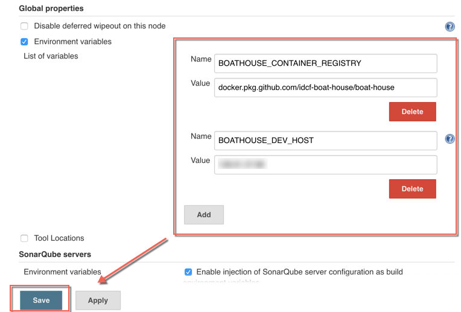
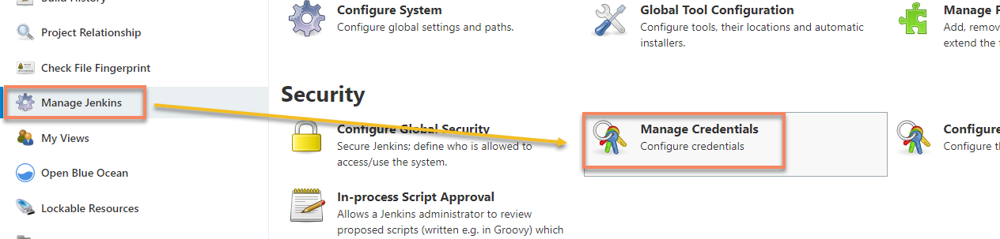
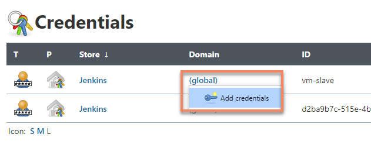
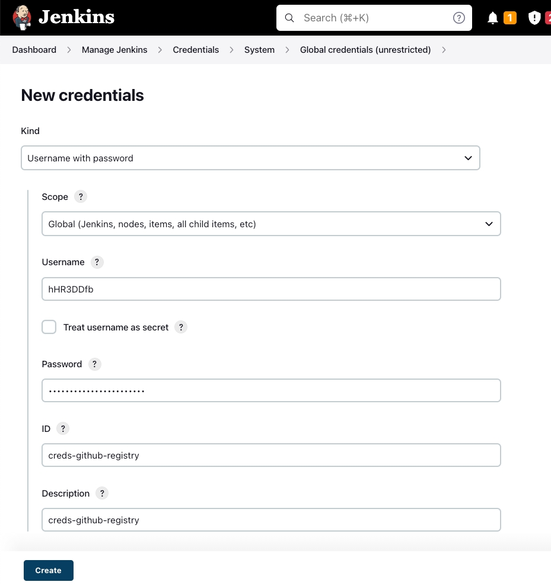

# Jenkins环境变量配置

## 前置说明：

Boathouse流水线为了适配不同团队环境，使用了大量环境变量和凭据变量分离不同团队的流水线环境，比如：镜像仓库地址，DEV/TEST/PROD环境地址和访问密钥，容器镜像仓库地址等。

本文档描述了如何配置这些变量以便隔离本团队的流水线环境。

## 添加全局变量

1. 进入Jenkins | 点击 Manage Jenkins | 点击Config System | 找到 Global properties | 选中 Environment variables | 点击 ADD

添加如下环境变量（注意复制环境变量以及值的时候避免多复制了空格）：

| 变量名称 | 值 | 说明  |
| ------------ | --------- | --------- |
| BOATHOUSE_CONTAINER_REGISTRY  | 容器镜像仓库地址 | 支持团队提供的容器镜像仓库地址 |
| CREDS_GITHUB_REGISTRY_USR  | 容器镜像仓库用户名|支持团队提供的容器镜像仓库用户名|
| CREDS_GITHUB_REGISTRY_PSW  | 容器镜像仓库密码| 支持团队提供的容器镜像仓库密码|
| BOATHOUSE_DEV_HOST  | boathouse-pipeline-vmlc  |
| BOATHOUSE_ORG_NAME | idcf-boat-house  | 团队镜像仓库组织名称 |
| DEPLOY_K8S_NAMESPACE_TEST | boathouse-test | k8s命名空间，即boathouse测试环境部署的命名空间 |
| DEPLOY_K8S_NAMESPACE_PROD | boathouse-prod | k8s命名空间，即boathouse生产环境部署的命名空间 |

添加完成后如下图所示：

## Jenkins添加Docker VM的连接密钥

打开Jenkins流水线，进入凭据配置界面，点击添加凭证

添加boathouse-pipeline-vmlc的连接密钥

用户名密码为登陆vm-dev的用户名:smartide 密码:root123，ID需为‘creds-dev-server’。

## Jenkins添加Docker Registry的连接密钥

管理员提供给本组的镜像仓库的用户名以及密码，ID需'creds-github-registry’。

  

## Jenkins添加SonarQube链接Token（类型：Secret Text）

Secret可以暂时不填写，后面配置Sonar时在配置,ID需 ‘token_sonarqube’

注意：此配置虽然在没有用sonar的情况下没有用，但是jenkinsfile中使用了这个token，如果不配置流水线将无法运行。你可以在后续启用son的时候再更新此token为正确的取值，当前可以输入任何内容

