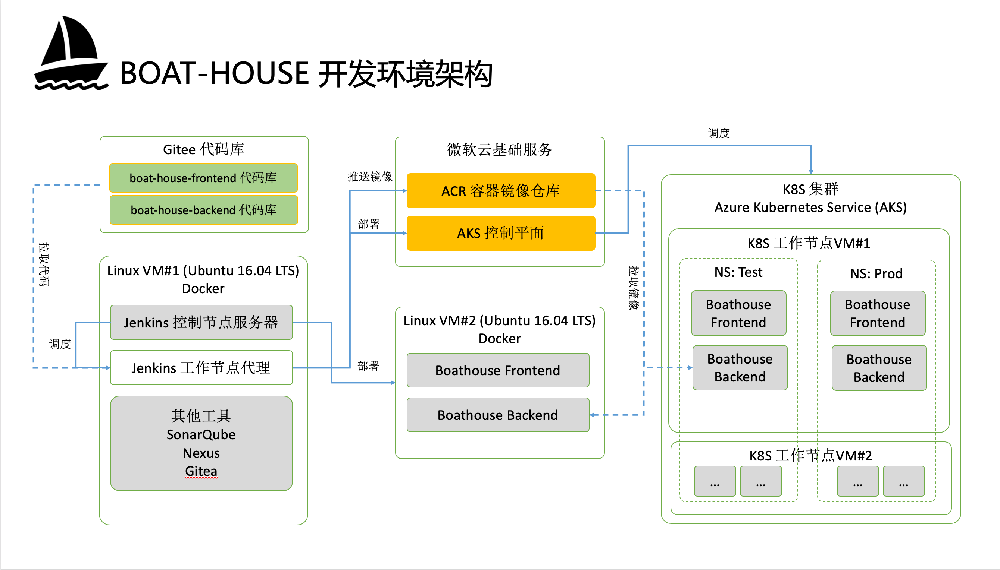

# IDCF DevOps 黑马马拉松操作手册

## 1. 环境概述

为了能让团队更好的进行开发调试包括对整个DevOps工具链进行搭建以及测试，我们为每个团队提供了以下配套环境

环境配置如下：

- 2台 Linux 虚拟机（团队自行分配2台VM的用途）
  - VM#1: VM-Tools（用于搭建工具链） （CPU: 2 Core MEM: 8G）
  - VM#2: VM-Dev（用于搭建测试环境） （CPU: 2 Core MEM: 4G）
- 1个 容器镜像仓库 （使用微软Azure云的Azure Container Registry)
- 1个 k8s 集群（使用微软Azure云的Azure Kubernetes Services）
  - k8s 总会通过 命名空间（NS）划分成 Test/Prod 两个环境

### 获取团队云资源

黑客马拉松的环境通过 [DevOps实验室](https://labs.devcloudx.com) 提供，讲师会在现场发放环境激活码给各团队的负责人。

**注意：每一个团队只有一套环境! 大家注意做好分工。**

## 2. 基础流水线搭建和dev环境部署

### 2.2 团队环境配置

- [示例代码导入](version-control-config.md): 按照此文档完成Gitee上面的代码库复制（Fork）。

- [Jenkins服务器搭建](team-env-config.md)：按照此文档完成Jenkins服务器搭建，添加节点并安装插件。

- [Jenkins环境变量配置](team-pipeline-config.md)：按照此文档完成Jenkins中各种环境变量和密钥的配置

### 2.3 Boathouse 前后端流水线搭建 - 部署到DEV环境

- [完成流水线搭建并部署到Dev环境](team-dev-env-deploy.md)：完成流水线搭建，并使用流水线完成Dev环境的自动化部署

### 2.4 团队快速开发指南 - 本地调试（可选）

- [快速开发指南](dev-guide.md)：搭建本地开发环境，完成Boathouse前后端代码的联调。

## 3. 完整流水线搭建和测试/生产环境部署

### 3.1 加分项必选项 - 团队 k8s 环境（TEST & PROD）部署

**注意**：团队必须首先完成此加分项才能开始进入3.2所列的其他加分项，否则视为无效得分。

- [使用流水线完成Test/Prod环境的自动化部署](team-k8s-env-config.md)：按照此文档完成K8s环境中的 Test 和 Prod 两个环境的部署。

### 3.2 加分项 - 高级流水线组件

**注意**：请仔细阅读以下加分项的任务列表和验收标准，参考文档中的内容仅作为参考，不提供详细的操作指南。必要的时候请自行查阅网上的资料。

| 序号 | 任务名称 | 验收标准  |
| ------------ | --------- | --------- |
| 001 | 在流水线中增加基于SonarQube的静态代码检查 | 完成SonarQube服务器搭建并集成到现有流水线，可以通过SonarQube页面查看后端代码的检查结果。如果可以修复至少一个代码问题，额外加1分。 参考文档 [Sonarqube配置指南](../../quick-start/guide/sonarqube/Readme.md) |
| 002 | 在流水线中添加单元测试环节 | 通过现有流水线执行代码中提供的单元测试用例，可以通过Jenkins内置的测试结果视图查看测试结果，如果可以增加一个以上的测试用例，额外加1分。 参考文档 [快速创建Junit测试](../..//quick-start/guide/junit-testing/Readme.md) [Idea 快速创建Junit测试](../../quick-start/guide/junit-testing/Readme.md) |
| 003 | 在流水线中集成基于 Selenium 的自动化UI测试 | 在DEV环境部署Selenium Grid环境，并使用 Selenium Grid 运行文档中提供的测试代码，最终需要在流水线中执行这些测试并且通过 jenkins 的测试结果视图查看到结果。参考文档 [Selenium自动化UI测试](../../quick-start/guide/selenium-ui-testing/Readme.md) [Jenkins调度Selenium](../../quick-start/guide/selenium-for-jenkins/Readme.md) |
| 004 | 使用 PostMan 进行接口测试 | 安装并使用 PostMan 为Boathouse后台的2个接口添加接口测试用例，导出这些用例并使用 Newman 集成到流水线中。参考文档 [Postman接口测试指南](../../quick-start/guide/postman-api-testing/Readme.md)   |
| 005 | 使用 Neuxs 管理依赖和制品  | 搭建 Nexus 服务器并使用这台私有制品服务器管理本团队的外部依赖和待发布制品，待发布制品需要通过流水线实现自动上传和版本对其（制品版本与Jenkins构建ID的双向跟踪， 参考文档 [Nexus搭建及使用指南](../../quick-start/guide/nexus/readme.md) |
| 006 | 进行 Jmeter 自动执行接口/性能测试 | 搭建Jmeter环境，完成JMeter测试用例编写并在流水线中自动执行，可以正确查看JMeter测试报告。参考文档 [JMeter测试用例编写手册](../../quick-start/guide/jmeter-testing/Readme.md) [Jenkins集成Jmeter](../../quick-start/guide/jmeter-testing/jmeter-for-jenkins.md) |
| 007 | 使用 Flyway 管理结构化数据库的持续交付 | 搭建Flyway环境，并通过Flyway集成流水线完成至少一个数据库字段的结构变更，变更内容需要自动发布到DEV环境。参考文档 [使用 Flyway 进行数据库持续交付](../../quick-start/guide/java-flyway-db-pipeline/Readme.md) |

参考文档：[Boathouse工具链指导文档列表](../../../README.md?id=工具指导文档) 这里列出了所有相关的工具链指导文档，供参考。

## 小结

本文档描述了IDCF DevOps 黑客马拉松的流水线搭建过程。
