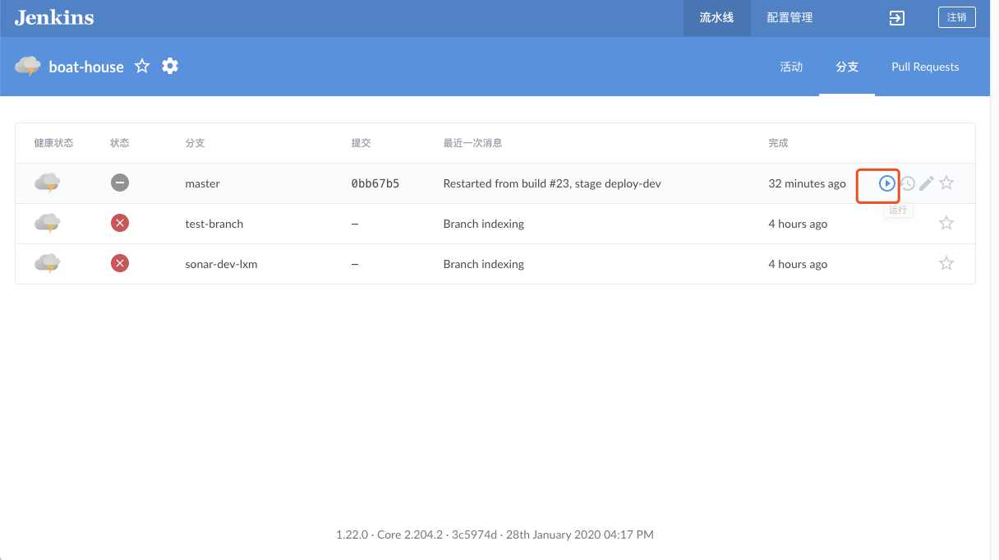
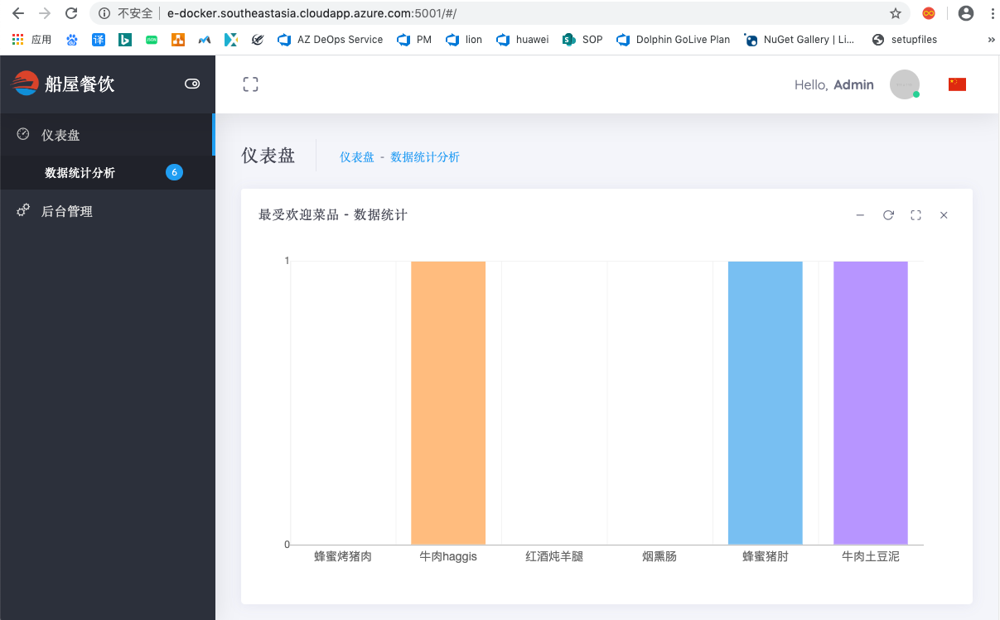

# 完成Boathouse流水线搭建并部署到DEV环境

在前面的文档中，我们已经部署好Jenkins的流水线，接下来将部署Boathouse的Dev环境所使用的虚拟机。
我们将会在云资源的另外一台虚拟机 Docker VM 上部署团队自己的Dev环境：

## DEV环境虚拟机配置

### 登录虚拟机

使用ssh登录vm1

```shell
## 如果使用DevOps实验室环境，请使用实验室环境资源中提供的用户名
## 我们提供了2台VM，请自行决定2台VM的角色
ssh <username>@<ip/hostname>
```

### 安装Docker和Docker-Compose工具

```shell
## 更新包管理数据库
sudo apt-get update
## 安装docker
sudo apt install docker.io
sudo usermod -a -G docker {你当前的登录用户名}

## 安装docker-compose
### docker-compose 官方安装地址（如果此地址安装不成功，请使用以下国内镜像地址）
sudo curl -L "https://github.com/docker/compose/releases/download/1.29.2/docker-compose-$(uname -s)-$(uname -m)" -o /usr/local/bin/docker-compose
## docker-compose 国内镜像
sudo curl -L https://get.daocloud.io/docker/compose/releases/download/1.29.2/docker-compose-`uname -s`-`uname -m` -o /usr/local/bin/docker-compose
sudo chmod +x /usr/local/bin/docker-compose

## 启动 docker 服务
sudo systemctl daemon-reload
sudo systemctl restart docker 

## 设置 docker 用户权限
sudo groupadd docker 
sudo gpasswd -a $USER docker
newgrp docker
```

运行完以上命令重新登陆虚拟机,并执行以下命令，测试Docker是否安装成功

```shell
docker --version
docker-compose --version
```

## 导入Boathouse前后端代码流水线配置

1. 进入jenkins首页，点击进入左侧菜单栏中 **open blue ocean** 的菜单


1. 进入后，根据提示，点击下方的按钮，创建流水线


1. 仓库类型选择 git,如下图所示：


2. 获取仓库地址，如下图所示：


3. 输入boat-house-frontend仓库地址，并点击创建流水线，如下图所示：


4. 流水线创建中


5. 进入流水线主页，可以看到基于Repo中Jenkins File成功创建出流水线。


6. 点击当前流水线进入流水线活动页面


7. 点击分支 Tab，点击某个分支后的修改button可以查看流水线的具体设置及任务


8. 修改jenkinsfile默认地址：


9. 脚本路径改为：devops/jenkins/jenkinsfile


10. 按照同样的方式完成boat-house-backend仓库的导入以及配置。

## 启动master分支构建

1. 点击master分支后面的构建button，启动构建

1. 构建过程中查看输出情况


### 查看部署结果

Dev环境部署完毕，打开以下链接，查看部署结果：
1. Client Web 
http://{vm-dev ip address}:5000

1. Management Web
http://{vm-dev ip address}:5001

1. Product Service AP Swagger UI
http://{vm-dev ip address}:7001/api/v1.0/swagger-ui.html


**注意：暂时没有提供k8s集群环境，所以大家暂时不要部署测试以及生产环境**
