### 登录虚拟机

使用ssh登录vm-tools

```shell
## 如果使用DevOps实验室环境，请使用实验室环境资源中提供的用户名
ssh <username>@<ip/hostname>
```

### 1. Docker 安装

由于整个环境我们都使用容器的进行部署，所以需要在环境中先安装Docker以及docker-compose，执行以下shell命令安装。

```shell
## 更新包管理数据库
sudo apt-get update
## 安装docker
sudo apt install docker.io
sudo usermod -a -G docker {你当前的登录用户名}

## 安装docker-compose
### docker-compose 官方安装地址（如果此地址安装不成功，请使用以下国内镜像地址）
sudo curl -L "https://github.com/docker/compose/releases/download/1.29.2/docker-compose-$(uname -s)-$(uname -m)" -o /usr/local/bin/docker-compose
## docker-compose 国内镜像
sudo curl -L https://get.daocloud.io/docker/compose/releases/download/1.29.2/docker-compose-`uname -s`-`uname -m` -o /usr/local/bin/docker-compose
sudo chmod +x /usr/local/bin/docker-compose

## 启动 docker 服务
sudo systemctl daemon-reload
sudo systemctl restart docker 

## 设置 docker 用户权限
sudo groupadd docker 
sudo gpasswd -a $USER docker
newgrp docker
```
> 注意，如果运行`sudo usermod -a -G docker ghuser` 出错，请执行`sudo apt-get remove unscd`后再执行一次。

运行完以上命令重新登陆虚拟机,并执行以下命令，测试Docker是否安装成功

```shell
# docker
docker --version

# docker-compose
docker-compose --version
```

### 2. 搭建Jenkins
使用以下命令完成Jenkins的安装

```
sudo mkdir ~/jenkins_home 
sudo chown -R 1000:1000 ~/jenkins_home
sudo docker run -d -p 8080:8080 -p 50000:50000 --env JAVA_OPTS=-Dhudson.model.DownloadService.noSignatureCheck=true -v ~/jenkins_home:/var/jenkins_home -u 0 jenkins/jenkins:lts
docker ps
```
如果在拉取Jenkins镜像过程中速度较慢，请联系支持团队获取国内镜像登录以及拉取命令

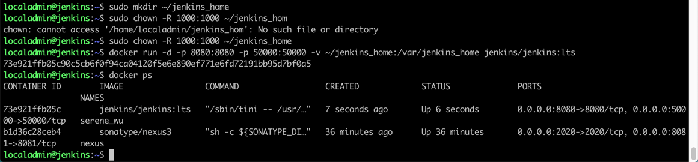

##### 获取管理员账号密码
``` 
sudo cat jenkins_home/secrets/initialAdminPassword
```


复制上面的输出结果

##### 启动Jenkins网站
在浏览器中打开jenkins站点，粘贴上面的管理员密码，并点击 **Continue** 按钮


##### 选择安装建议插件
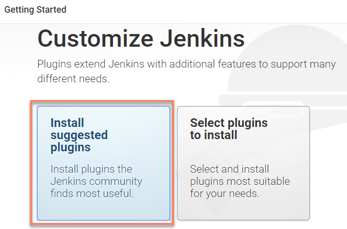

> 注意，如果vm在国内，插件很有可能安装不上去，如果装不上去，请参考这个[文档](https://gitee.com/hummerstudio/jenkins-update-center-changer) ，步骤如下
```
1. ssh到jenkins所在的vm,执行 dockker ps，获取容器id
1. 进入容器：sudo docker exec -it [容器id] /bin/bash
1. 执行： bash -c "$(curl -fsSL https://gitee.com/hummerstudio/jenkins-update-center-changer/raw/master/jenkins-update-center-changer.sh)"
1. 进入插件中心： http://[jenkins url]/pluginManager/advanced, 点击最底部的 get
1. 重新进入插件初始化页面。
1. 如果无法打开插件初始化页面，可手动删除jenkins_home文件，重启容器，重复上面的步骤。
```

##### 初始化管理员账号密码，都填写为admin即可，然后点击 **Save and Continue**


##### 保持默认的URL设置
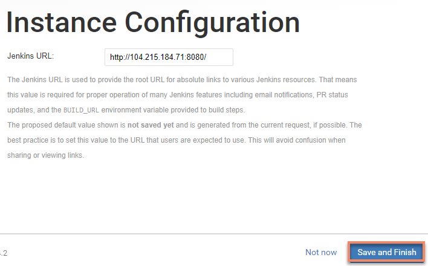

##### 完成服务器搭建，启动Jenkins
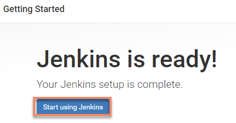

****

#### Jenkins 配置
Jenkins流水线中的各个任务的运行需要跑在一台代理机上，因此我们需要给Jenkins添加构建节点。
在本示例中将使用本机同时作为 Jenkins VM 作为代理机。


##### 代理机安装JDK
```
sudo apt-get install openjdk-8-jdk
java -version
```

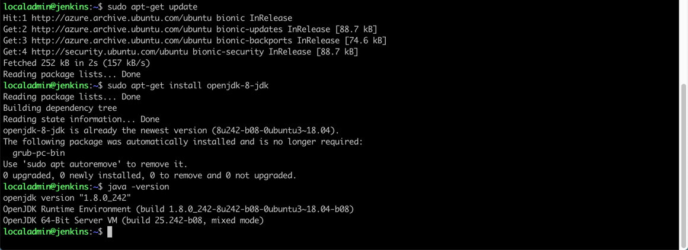

##### 安装Maven

```
sudo apt install maven
```

##### 代理机添加 vm帐号（当前登陆账号）至Sudoers
1. 添加 ghuser 至sudo组：
    ```
    sudo usermod -aG sudo <当前用户用户名>
    ```
1. 添加 ghuser 至sudoers文件：
    ```    
     pkexec visudo #（或者是sudo vim /etc/sudoers）
    在# /etc/sudoers文件最末尾添加下面代码：
    ghuser ALL=(ALL) NOPASSWD:ALL
    ```

##### 代理机创建Jenkins工作目录, 并创建文件确保目录在非sudo下可写
  ```
  mkdir jenkins_workspace
  cd jenkins_workspace
  touch test
  ls
  ```


##### Jenkins添加构建节点
1. 在jenkins管理界面进行节点管理，**Manage Jenkins**

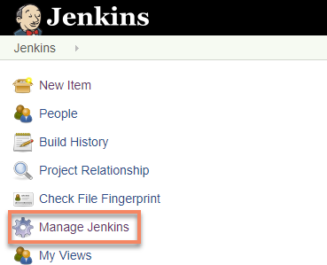

1. 点击 **Manage Nodes** 


1. 点击  ** New Node**

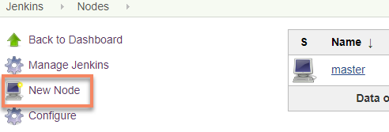

1. 按照下图输入代理名称并勾选**Permanent Agent**，然后点击 **OK**


1. 在创建节点界面输入参数:
    | 参数名 | 参数值 |
    |--|--|
    | # of executors | 1 |
    | Remote root directory	 | /home/ghuser/jenkins_workspace |
    | Labels | vm-slave (此处很关键，后面JenkinFile流水线文件中会根据此label选取代理机) |
    | Launch method | Launch agents via SSH |
    | Host | vm-tools 虚拟机公网IP地址 |
    | Host Key Verification Strategy | Non verifying Verification Strategy |

1. 创建链接到salve容器认证
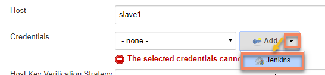

1. 在认证编辑界面输入参数：
    | 参数名 | 参数值 |
    |--|--|
    | Username | {vm-tools虚拟机用户名} |
    | Password | {vm-tools虚拟机密码} |
    | ID | vm-slave |
    | Description | vm-slave |

1. 然后点击 **Add**
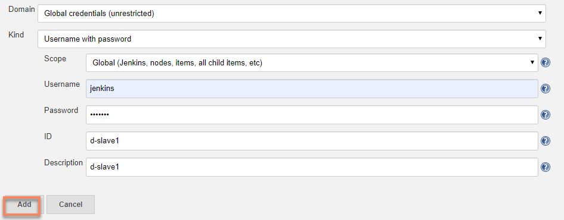

1. 返回节点编辑界面后，选择刚才新建的认证
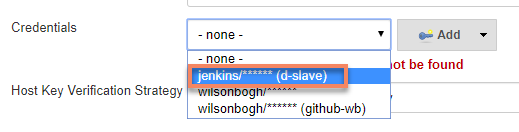

1. 完成节点编辑，点击**Sava**


1. 回到列表页面后启动节点
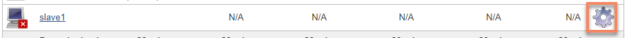

1. 按照下图手动点击启动节点


1. slave正常启动


1. 回到节点列表


1. 节点显示正常


##### Jenkins安装插件

1. 打开Jenkins控制面板首页，在左侧菜单中选择 **管理Jenkins** ，进入管理页面后，点击 **管理插件**，安装插件： Cobertura、Kubernetes Continuous Deploy、SSH Pipeline、Blue Ocean
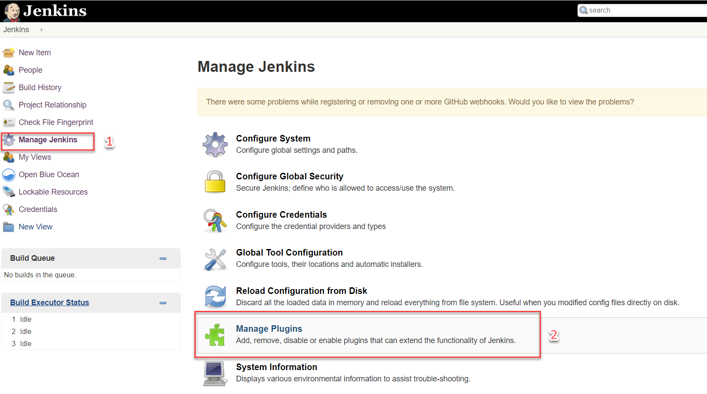
1. 进入插件页面， 选择项目的 **可用** tab，并在上面搜索框中输入 **cobertura** 找到cobertura插件，选择安装

1. 进入插件页面， 选择项目的 **可用** tab，并在上面搜索框中输入 **Kubernetes Continuous Deploy** 找到k8s CD 插件，选择安装

1. 进入插件页面， 选择项目的 **可用** tab，并在上面搜索框中输入 **SSH Pipeline** 找到SSH Pipeline Steps插件，选择安装

1. 进入插件页面， 选择项目的 **可用** tab，并在上面搜索框中输入 **Blue Ocean** 找到blueocean插件，选择安装
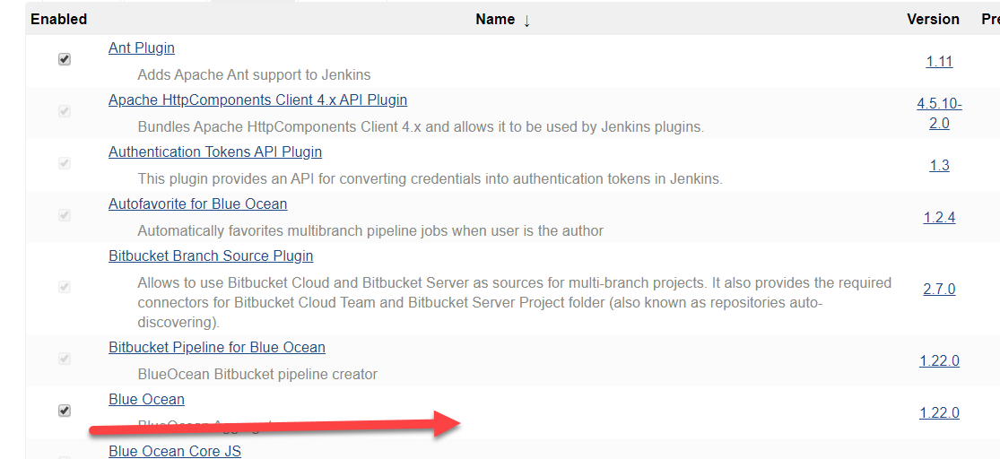


1. 请确保所有插件安装成功，如有失败情况，需要卸载插件重新安装，如下图失败示例：


1. 重启Jenkins服务器

打开重启界面，http://ip:8080/restart
点击是，如下图所示：


重启中，如下图所示：


至此，团队环境中的Jenkins设置完毕。
****
