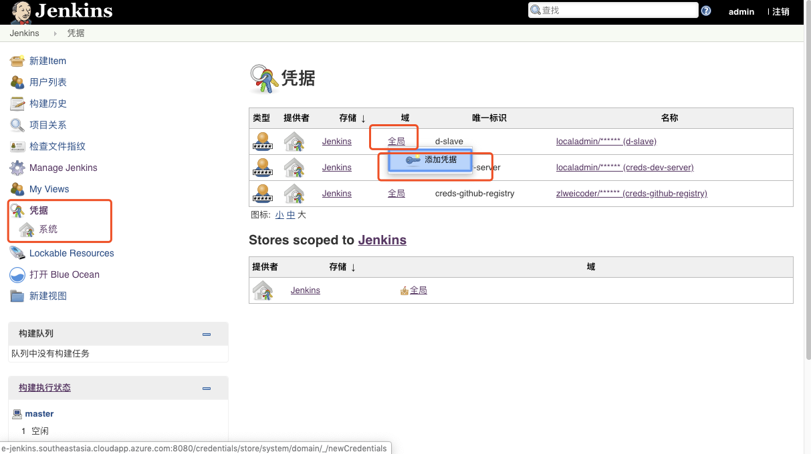
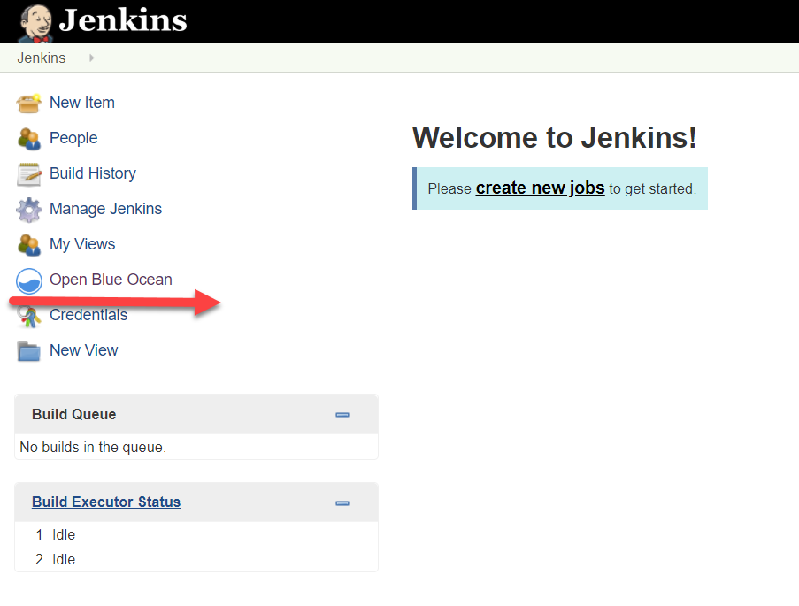
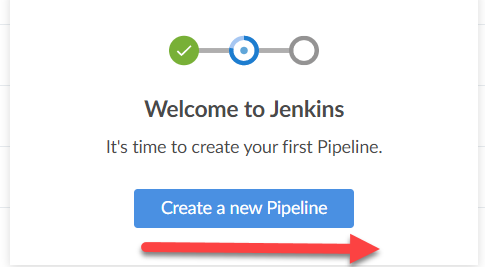
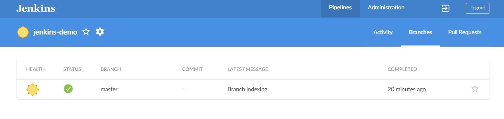

### Gitee集成Jenkins搭建流水线

#### 前置说明：

**配置Gitee之前，团队需要选定一个Gitee账号跟Jenkins环境集成

##### 添加全局变量

1. 进入Jenkins | 点击 Manage Jenkins | 点击Config System | 找到 Global properties | 选中 Environment variables | 点击 ADD

添加如下环境变量（注意复制环境变量以及值的时候避免多复制了空格）：

| 变量名称 | 值 | 说明  |
| ------------ | --------- | --------- |
| BOATHOUSE_CONTAINER_REGISTRY  | 容器镜像仓库地址 | 支持团队提供的容器镜像仓库地址 |
| CREDS_GITHUB_REGISTRY_USR  | 容器镜像仓库用户名|支持团队提供的容器镜像仓库用户名|
| CREDS_GITHUB_REGISTRY_PSW  | 容器镜像仓库密码| 支持团队提供的容器镜像仓库密码|
| BOATHOUSE_DEV_HOST  | 请使用实际 | Dev环境IP地址  |
| BOATHOUSE_ORG_NAME | idcf-boat-house  | 团队镜像仓库组织名称 |
| DEPLOY_K8S_NAMESPACE_TEST | boathouse-test | k8s命名空间，即boathouse测试环境部署的命名空间 |
| DEPLOY_K8S_NAMESPACE_PROD | boathouse-prod | k8s命名空间，即boathouse生产环境部署的命名空间 |

添加完成后如下图所示：

##### Jenkins添加Docker VM的连接密钥

1. 打开Jenkins流水线，进入凭据配置界面，点击添加凭证

2. 添加vm-dev的连接密钥
用户名密码为登陆vm-dev的用户名密码，ID需为‘creds-dev-server’。

##### Jenkins添加Docker Registry的连接密钥

管理员提供给本组的镜像仓库的用户名以及密码，ID需'creds-github-registry’。

##### Jenkins添加SonarQube链接Token（类型：Secret Text）

Secret可以暂时不填写，后面配置Sonar时在配置,ID需 ‘token_sonarqube’

注意：此配置虽然在没有用sonar的情况下没有用，但是jenkinsfile中使用了这个token，如果不配置流水线将无法运行。你可以在后续启用son的时候再更新此token为正确的取值，当前可以输入任何内容

##### Jenkins配置

1. 进入jenkins首页，点击进入左侧菜单栏中 **open blue ocean** 的菜单

1. 进入后，根据提示，点击下方的按钮，创建流水线

1. 仓库类型选择 git,如下图所示：

2. 获取仓库地址，如下图所示：

3. 输入boat-house-frontend仓库地址，并点击创建流水线，如下图所示：

4. 流水线创建中

5. 进入流水线主页，可以看到基于Repo中Jenkins File成功创建出流水线。

6. 点击当前流水线进入流水线活动页面

7. 点击分支 Tab，点击某个分支后的修改button可以查看流水线的具体设置及任务

8. 修改jenkinsfile默认地址：

9. 脚本路径改为：devops/jenkins/jenkinsfile

10. 按照同样的方式完成boat-house-backend仓库的导入以及配置。

**注意：** 此时流水线仍然无法正确运行，因为流水线中已经包含了对DEV环境的部署动作，但是我们还没有完成DEV环境虚拟机的配置。请继续后续文档。

