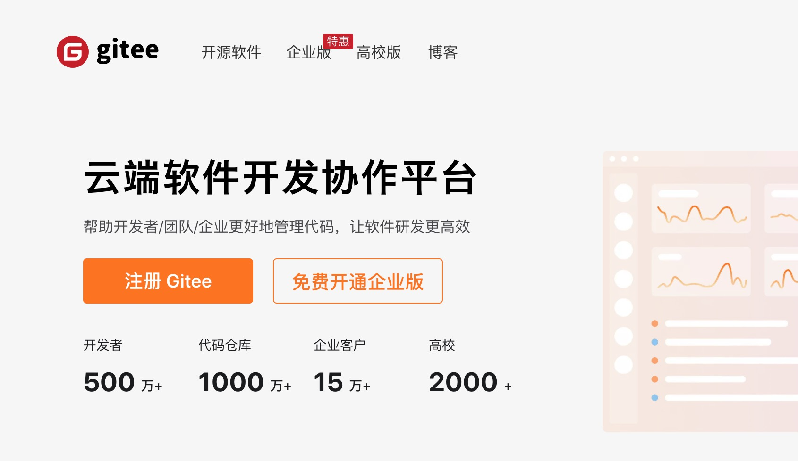
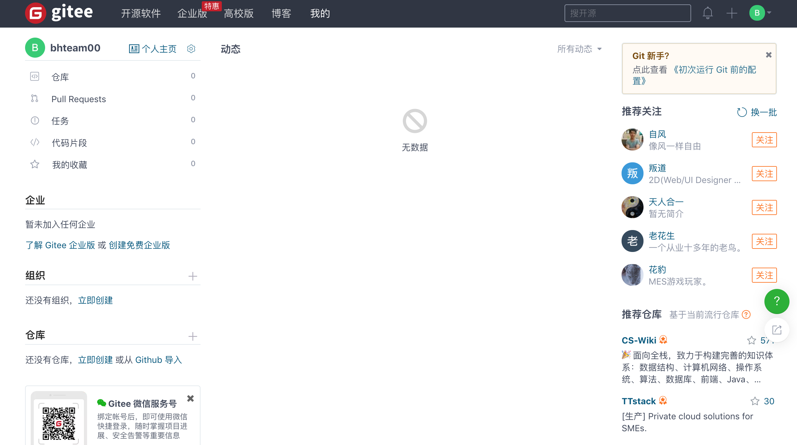
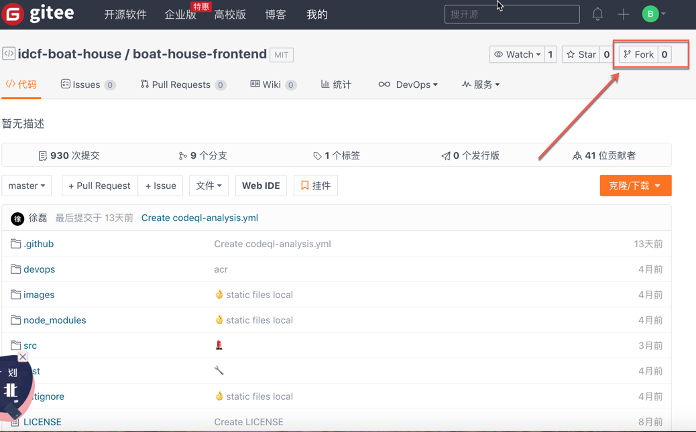
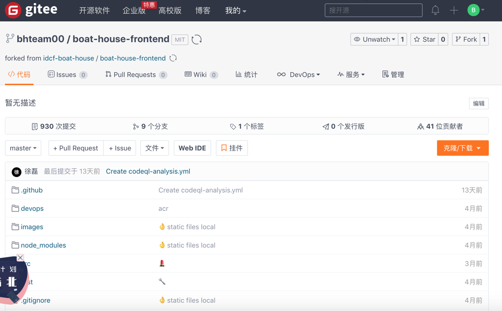

在本实验中我们使用Gitee作为代码托管以及管理的平台，所以我们需要申请Gitee账号，并将示例项目导入到Gitee平台中。

###### 1.1 注册Gitee账号

1. 打开Gitee站点：https://gitee.com ,点击注册Gitee

2. 输入自己的团队，账号以及密码，点击注册，如下图所示：

3. 注册完成后，如下图所示：

###### 1.2 Folk Boathouse示例代码

1. 打开代码仓库：https://gitee.com/idcf-boat-house/boat-house-frontend

2. 点击Folk，如下图所示：

3. 选择组织，并点击确定，如下图所示：

4. Folk完成后，如下图所示：

5. 按照以上同样的方式Folk BoatHouse后端代码库：

https://gitee.com/idcf-boat-house/boat-house-backend

